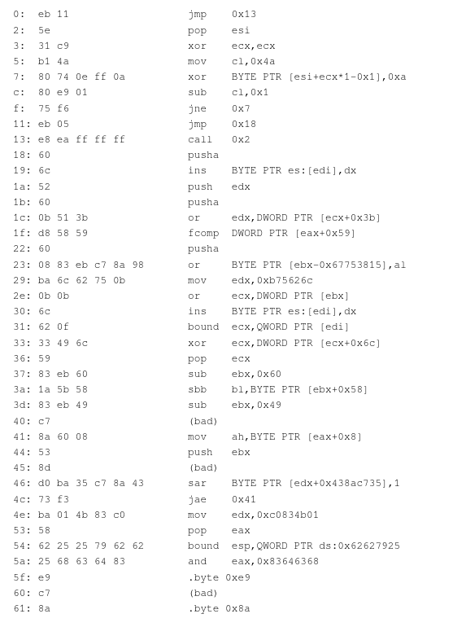
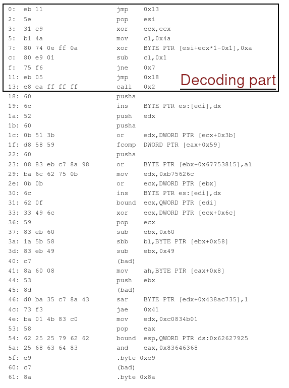

# Création de shellcode polymorphique

le programme poly_xor permet de générer un shellcode polymorphique xoré, rendant l'analyse statique de ce shellcode plus compliqué.

il suffit de rentrer le shellcode dans la variable shellcode du programme, eventuellement de changer la valeur avec laquelle ce shellcode va etre xoré dans la variable xorval. puis compiler le programme (en x86)

`gcc -m32 poly_xor.c -o poly_xor`

et l'executer afin qu'il print le shellcode ainsi obtenu.

le programme test_shellcode.c peut etre lui utilisé afin de tester que le shellcode a bien le comportement attendu

le shellcode utilisé pour l'instant est disponible ici, créé par @MrTuxRacer :
http://shell-storm.org/shellcode/files/shellcode-883.php

il ne contient pas de null bytes a condition que l'adresse IP sur lequelle le reverse se connecte n'en contienne pas (d'ou l'utilisation de 127.1.1.1 et non 127.0.0.1)

